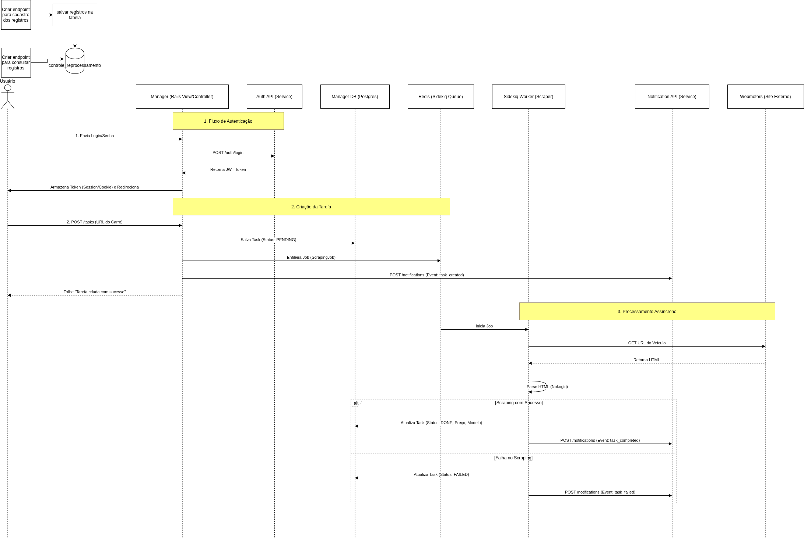

# Webscraping Manager (Aplicação Principal)

Frontend e Orquestrador do sistema. Responsável pela interface com usuário, gerenciamento de filas de scraping e integração com os microsserviços.

## Arquitetura & Responsabilidades



* **Frontend:** Interface moderna construída com **Tailwind CSS** e ERB.
* **Backend:** Ruby on Rails 8.1
* **Workers:** **Sidekiq + Redis** para processamento assíncrono de tarefas pesadas.
* **Scraper:** Engine construída com **Nokogiri** e **Faraday**, capaz de contornar bloqueios WAF simples.

##Requisitos
* **Ruby:** 3.4.7
* **Banco:** PostgreSQL.
* **Cache/Fila:** Redis.

## Como Executar

A aplicação roda na porta **3000**.

```bash
# Na raiz do projeto webscraping-manager
sudo docker-compose up --build
```

Ao iniciar, o container executa automaticamente:
- Criação/Migração do Banco.
- Build do Tailwind CSS.
- Inicialização do servidor Puma.

Acesse: http://localhost:3000


## Funcionalidades (Endpoints de UI)

O sistema utiliza arquitetura MVC clássica, mas integra APIs internamente:

| Rota | Descrição |
|------|-----------|
| `GET /` | Dashboard (Requer Login). |
| `GET /login` | Formulário de Autenticação (Integra com Auth Service). |
| `GET /tasks` | Listagem de tarefas de scraping. |
| `POST /tasks` | Cria nova tarefa e dispara Job no Sidekiq. |
| `GET /tasks/:id` | Visualiza detalhes e JSON coletado. |

## Qualidade de Código e Testes


**Rodar Testes (RSpec):**
```bash
sudo docker-compose exec webscraping-manager bundle exec rspec
```

**Verificar Linter (Rubocop):**
```bash
sudo docker-compose exec webscraping-manager bundle exec rubocop
```


